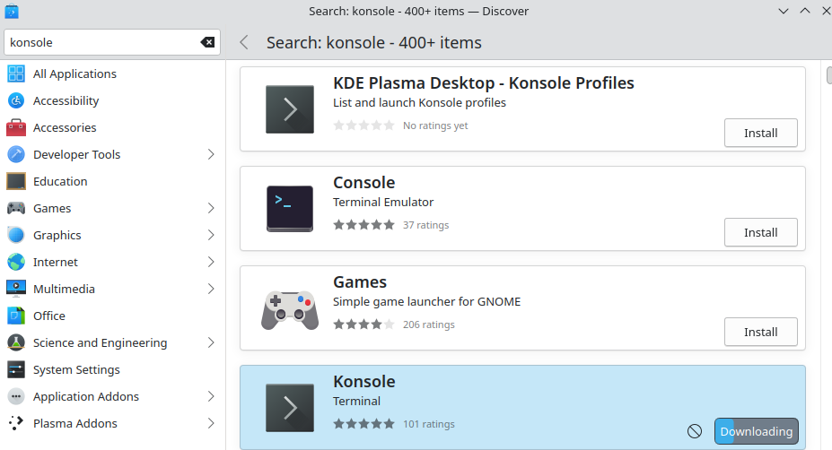

////DO EXTRA MILES
Have an extra mile seciton where you fix things that are not scored but vulnerable or that need fixing
-ssh keys
-remove bad console prompt


# __ImaginaryCTF 2023 Syshardening 8 writeup__:
By: Vague (with thanks to Uvuvue, RJCyber, and my CTF team SPL [specifically Donkey and Brayden])


# The Challenge
We are given a virtual machine that needs hardening, there are 42 vulnerabilities each worth 1-3 points to add up to 100 points. At the beginning of the competition, you will need 100 points to get the flag. As the competition continues, every two hours the score needed to claim the flag will decrease by 1. This threshold will keep decreasing until the first team attains the flag. By the end of the competition, the needed points was 78.

***note that you start out with a vulnerability "Previous passwords are remembered" already being scored so you have 2 points** 

# Prerequisites
To solve this challenge, you will need to download VMware workstation 17 player. Install the .7z file linked to the challenge and extract this file. Upon extraction open up the .vmx file found within the extracted folder. Upon loading you will be booted up into a Fedora 38 virtual machine with a README file, Scoring Report file, and Forensic Question files on your desktop. This problem requires a multistep solution in which you are required to patch vulnerabilities and answer forensics questions on the image to reach 100. Each vulnerability patched gives a certain amount of points dependent on the difficulty of the vulnerability and each Forensic Question gives a standard 3 points. Upon loading, the first step in securing this image would be to read the ReadMe file on your desktop containing addition information regarding the challenge such as scenario specific configuration requirements.

# The Desktop
Once you've booted up, you can see a desktop containing 10 text files, Forensic Questions, which each contain a question and a spot for the answer. Each Forensic Question correctly answered gives you 3 points. You can also see a quick link to the README, an extremely important file containing scenario specific information that you must follow during your configuration of the machine. Along with this is your ScoringReport which displays the vulnerabilities you have gotten along with their point values and your total score. This image also contains links to root directories but this has little to do with the image and is not important. Here is what the README looks like: https://eth007.me/cypat/syshardening8/


# Fixing all the broken things
Before we get to the Forensics Questions and eventually the vulnerabilities, there is a lot of things that this image has broken that we must fix or mitigate the effect of so that we may more easily go through it.

## Terminal
When you try to open up the terminal, a key thing needed to secure this system, you are given a weird looking bash prompt that returns an error every time you try to run a command

This is caused by a malicious Konsole profile set as the Default profile for our user running a malicious file /usr/bin/terminal that runs a command to print out a fake bash shell.
We can fix this issue by either:
* Switching to another user and changing our users Konsole profile to run /bin/sh
* Installing another terminal software

Due to it being much easier, I will just install *terminator*, a popular terminal that allows splitting the screen. To do this, open the Software Center application, type terminator in the search bar, scroll down until you see the application called terminator, and click install. 
Now simply click launch and you can run commands!

## Immutable files and chattr
If we run the command ```sudo find / -exec lsattr {} + 2>/dev/null | grep "\---i"```, we observe that many important files are immutable. If we try to change the attributes of any of these files with `chattr` we get put into that bash prompt that doesn't allow any commands to be executed. 
You can easily upload a good version of chattr to fix this but an easier way I found was to just reinstall Konsole.
Just like with terminator, open the Software Center application, type konsole in the search bar, scroll down until you see the application called Konsole, and click install.

Now that it is installed, chattr should work properly! To change the attributes of all the immutable files in one command, run:
```for i in $(sudo find /etc -exec lsattr {} + 2>/dev/null | grep "\---i" | awk '{print $2}');do sudo chattr -ia $i;done``` 
Now all we can write to all our important files!


## root's aliases 
If you try to run `ls` as root, you will see a train come across the screen, this is likely an alias set in root's .bashrc file.
To fix this, open up /root/.bashrc in your favorite text editor, and remove the two aliases at the bottom. 
Now close and reopen your terminator terminal to make these changes go into effect.

**There are still more problems that need to be fixed but those aren't relevant now**

<br>

# Forensic Questions

## Forensics Question 1 correct - 3 pts

```text
Greetings, fellow seekers of knowledge! We beckon your expertise on a quest of utmost importance. Deep within the digital realm, a hidden secret awaits our discovery. In the file /home/frodo/magic_cookie, a key of great significance lies concealed, encoded in the enigmatic language of hex representation. As esteemed adventurers, it is your noble duty to embark upon this quest, extracting the key from its cryptic confines. With unwavering determination and keen intellect, reveal to us the hex-encoded representation of this sacred key. May your endeavors be blessed with success, as together we unlock the secrets that await within the realms of Middle-earth's digital tapestry.

ANSWER:
```
After reading the question, It seems that we need to find the hex of some key stored in the file `/home/frodo/magic_cookie`
First I will read the contents of this file to hopefully get an idea of where I should start.

This file contains the readable strings "MIT-MAGIC-COOKIE". After googling this string, we see a Stack Overflow question asking how "X11 authorization works". One of the answers leads us to know what we need to do.

With this knowledge I will check my current user's(root) xauth file with the command `xauth`, I see that I am using the file `/root/.xauthSLVRP0` as my xauth key. We see in the Stack Overflow answer that you can view the key's hex representation with the command `list` inside of the `xauth` command. To solve this forensics question, I will copy the magical_cookie file to my xauth key file then run the xauth command to view the hex representation. 

Doing this gives us our answer, **b8ac3e1c12235ec54580131a511f2c9a**

<br>

## Forensics Question 2 correct - 3 pts

```text
Alas! The dreadful news has reached our ears. The malevolent presence of the Dark Lord Sauron looms over us, for he has insidiously infiltrated our very midst. Through his treacherous machinations, he has exploited a most ancient and forgotten vulnerability to gain access to our sacred realm of the computer. Like a cunning serpent, he has slithered through the digital shadows, utilizing this exploit as a nefarious key to breach our defenses. I beseech thee, wise one, to reveal the knowledge of the initial Common Vulnerabilities and Exposures (CVE) identification that pertains to this wickedly employed exploit. Only through such understanding may we begin to fathom the depths of his dark intentions and devise a plan to thwart his maleficent schemes.

ANSWER: 
```
After reading this, It appears that an exploit was ran that breached our system. Considering our two attack vectors are SSH and HTTP and SSH has a very little attack surface compared to HTTP, I first check the boa logs.
After reading the logs in **/var/log/boa/access_log**, it appears that someone was Dirbusting the webserver. We can tell this by the user-agent starting with "DirBuster-0.12". 

Now Dirbuster only fuzzes directories with a wordlist and does not have the capability to run exploits. To find logs of a potential web exploit, I will search the file for lines that don't contain the Dirbuster User-Agent with the command `cat /var/log/boa/access_log | grep -v "DirBuster-0.12"`. Near the bottom of this output we see someone trying to make a GET request to the cgi binary 'system-info' along with some interesting User-Agent fields that contain commands...

This is a very old and well-known exploit called Shell Shock. Looking up "shell shock http CVE", we get our answer **CVE-2014-6271**


<br>

## Forensics Question 3 correct - 3 pts

```text
With utmost urgency, we must embark upon a thorough investigation into the depths of this exploit that has beset us. As we tread this treacherous path, let us not falter in our quest for knowledge. Nay, we shall leave no stone unturned and no log unread in our relentless pursuit of the truth. Pray, enlightened beings, reveal unto us the elusive hour in Unix timestamp form, when the sinister Sauron, with his malicious intent, exploited our machine. Only by unraveling the fabric of time itself, represented in those cryptic numerical digits, shall we uncover the dark secret he concealed within the digital tapestry, and thus forge a defense against his insidious advances. Arise, my companions, and let our combined wisdom shine like a beacon amidst the shadows of uncertainty!

ANSWER:
```
